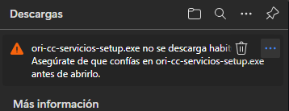
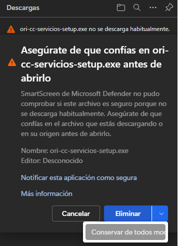
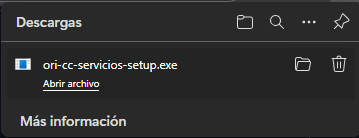
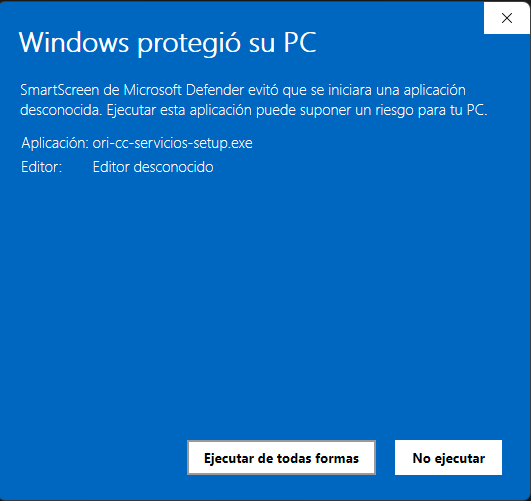
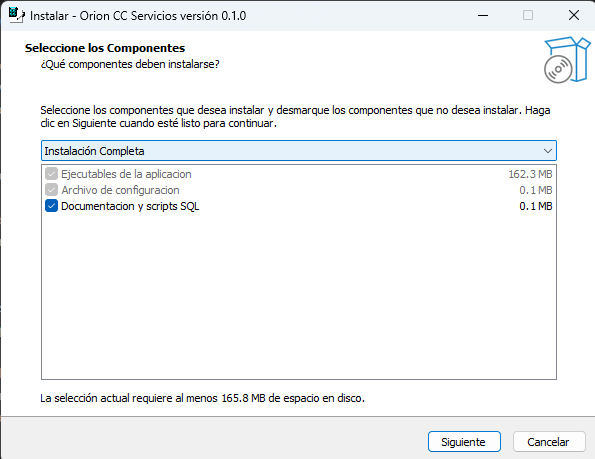

# 📋 Guía de Usuario para el Instalador

## Prerequisitos

- **Usuario con acceso especial a la base de datos**: Este usuario será configurado por el personal técnico de OPTIMUSOFT SAS.
- **Software necesario**: Debe tener instalado **Orión Plus** versión **17.38.417.1394** o superior, y acceso de usuario a Orión Plus.

## Pasos de Instalación

1. **Descarga el instalador**: Obtén la última versión desde [GitHub Releases](https://github.com/juandevian/cuenta_de_cobro_servicios/releases/latest).
2. **Ejecuta como Administrador**: Haz clic derecho en `ori-cc-servicios-setup.exe` y selecciona **"Ejecutar como administrador"**.
3. **Sigue el asistente**: Acepta las instrucciones del instalador hasta completar.
4. **Contacta soporte técnico**: Comunícate con OPTIMUSOFT SAS para que configuren tu usuario en la base de datos y el archivo `config.json`.

## Verificación de la Instalación

1. **Abre Orión Plus con tu usuario**: Tu usuario y contraseña te dan acceso automático al nuevo módulo.
2. **Navega a la ruta de prueba**: 
   - **Ventana Inicial de Orión Plus** > **Cobranza** > **Cobranza Automática** > **Programación de cobros automáticos** > **Importar Cobros por Consumo**.
3. **Verifica la conexión**: Al abrir el módulo, debe aparecer un **mensaje de conexión exitosa** en el histórico de operaciones. 
   - Si no aparece, comunícate con soporte de OPTIMUSOFT SAS al WhatsApp **+57 3116300406**.

---

## ⚠️ Solución a SmartScreen de Windows {#smartscreen}

### ¿Qué es SmartScreen?

**Windows SmartScreen** es una función de seguridad de Windows que protege contra archivos potencialmente peligrosos descargados de Internet. Cuando descargas `ori-cc-servicios-setup.exe`, es posible que veas advertencias como:

- *"ori-cc-servicios-setup.exe no se descarga habitualmente"*
- *"Asegúrate de que confías en ori-cc-servicios-setup.exe antes de abrirlo"*
- *"Editor: Desconocido"* o *"SmartScreen de Microsoft Defender no pudo comprobar si este archivo es seguro"*

### ¿Por qué ocurre esto?

Esta advertencia aparece porque el instalador **no tiene una firma digital** (certificado de código), que es costosa para proyectos pequeños o en fase beta. **No significa que el archivo sea malicioso** – es simplemente una precaución de Windows ante archivos sin firma reconocida.

### Solución Paso a Paso

#### Al Descargar (Navegador Edge/Chrome)

1. Cuando aparezca la advertencia en la barra de descargas, haz clic en **"..."** o **"Mostrar más"**.

   
   *Advertencia de descarga en el navegador - "ori-cc-servicios-setup.exe no se descarga habitualmente"*

2. Selecciona **"Conservar de todos modos"** o **"Keep anyway"**.

   
   *Clic en "Conservar de todos modos" para continuar con la descarga*

3. El archivo se guardará en tu carpeta de Descargas.

   
   *Archivo descargado exitosamente en la carpeta de Descargas*

#### Al Ejecutar (Windows Defender SmartScreen)

1. Al hacer clic derecho y seleccionar **"Ejecutar como administrador"**, puede aparecer una ventana de **SmartScreen**.

   
   *Ventana de SmartScreen - "Windows protegió tu PC"*

2. Haz clic en **"Más información"** o **"More info"**.

   
   *Después de hacer clic en "Más información" aparece el botón "Ejecutar de todos modos"*

3. Aparecerá un botón que dice **"Ejecutar de todos modos"** o **"Run anyway"** – haz clic ahí.

   
   *Clic en "Ejecutar de todos modos" para iniciar el instalador*

4. Permisos y antivirus

    Al ejecutar el instalador:

    - 🛑 **Windows Defender** puede mostrar una advertencia. Haz clic en **“Más información”** y luego en **“Ejecutar de todas formas”** para continuar.
    - 🛡️ **Antivirus externos** podrían analizar el archivo antes de permitir su ejecución. Este proceso suele tardar unos segundos.
    - 📦 Si el archivo es enviado a **cuarentena**, es probable que el antivirus no tenga escaneo en tiempo real activado. En ese caso:
    1. Abre tu antivirus y accede al almacén de cuarentena.
    2. Restaura el archivo.
    3. Agrega la ruta del instalador como **excepción**.

    > ⚠️ El proceso de restauración y exclusión varía según el antivirus. Consulta la documentación oficial de tu software de seguridad si lo necesitas.

### Verificación de Seguridad (Opcional)

Si quieres asegurarte de que el archivo es seguro:

1. **Verifica el hash SHA256**: 
   - Abre PowerShell en la carpeta de descargas y ejecuta:
     ```powershell
     Get-FileHash .\ori-cc-servicios-setup.exe -Algorithm SHA256
     ```
   - Compara el resultado con el hash publicado en [GitHub Releases](https://github.com/juandevian/cuenta_de_cobro_servicios/releases/latest).

2. **Escanea en VirusTotal** (opcional):
   - Sube el archivo a [VirusTotal.com](https://www.virustotal.com/) para un análisis de múltiples antivirus.
   - Algunos motores pueden marcarlo como sospechoso (falso positivo) por ser un ejecutable empaquetado con PyInstaller, pero la mayoría debería reportarlo como limpio.

### Contacto de Soporte

Si tienes dudas sobre la seguridad del archivo o encuentras problemas durante la instalación, contacta a:

- **Soporte Técnico OPTIMUSOFT SAS**: WhatsApp **+57 3116300406**
- **GitHub Issues**: [Reportar problema](https://github.com/juandevian/cuenta_de_cobro_servicios/issues)

---

---

## Ruta de Acceso al Módulo

Para acceder a la interfaz de usuario de importación, sigue esta ruta desde Orión Plus:

**Ventana Inicial de Orión Plus** > **Cobranza** > **Cobranza Automática** > **Programación de cobros automáticos** > **Importar Cobros por Consumo**

Aquí es donde deberás abrir la interfaz de usuario de importación.

---

## Pasos a seguir (Resumen)

1. **Descarga el programa**: Asegúrate de tener la última versión del instalador.
2. **Ejecuta el programa**: Haz doble clic en el archivo descargado para iniciar la instalación.
3. **Abre Orión Plus con tu usuario**: Tu usuario y contraseña te dan acceso de forma automática al nuevo módulo de Orión.
4. **Ve a la ruta de prueba**: Desde la ventana principal abre cobranza y continua la ruta descrita, al finalizar debes seleccionar *Importar Cobros por Consumo*
3. **Verifica la conexión**: Al abrir el módulo, debe aparecer un mensaje de conexión exitosa, en el histórico de operaciones. Si no aparece, comunícate con soporte de OPTIMUSOFT SAS al WhatsApp +57 3116300406.